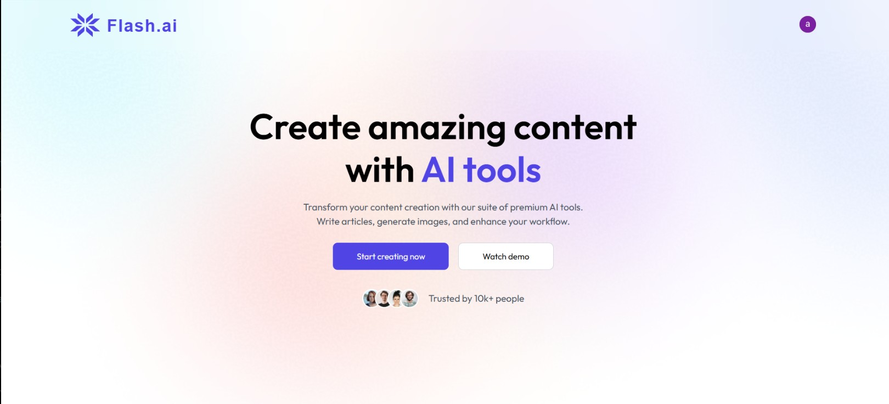
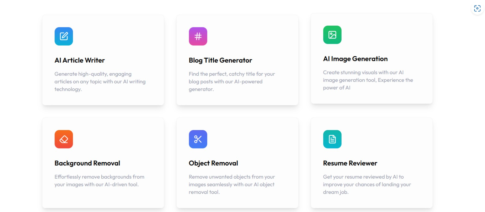
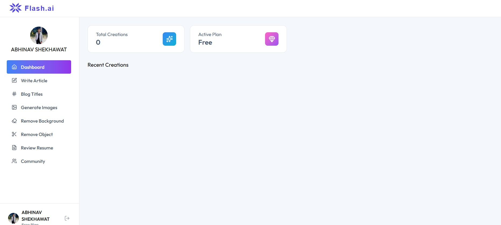

# ⚡ Flash.ai

<p align="center">


</p>

Flash.ai is a modern AI-powered SaaS platform that combines multiple AI tools into a single application. Users can generate articles, create blog titles, generate AI images, remove image backgrounds and objects, and review resumes through an intuitive and responsive interface.

---

## 🚀 Live Demo

🔗 https://flash-ai-mocha.vercel.app/

## 📂 GitHub Repository

🔗 https://github.com/ABHINAVSINGHSHEKHAWAT/FlashAi

---

# ✨ Features

- 🤖 AI Article Generator
- 📝 AI Blog Title Generator
- 🎨 AI Image Generator
- 🖼️ AI Background Remover
- ✂️ AI Object Remover
- 📄 AI Resume Reviewer
- 🔐 Secure Authentication
- 💎 Premium Subscription Plans
- 📜 User History
- 📊 Personal Dashboard
- 📱 Fully Responsive Design

---

# 📸 Screenshots

## Landing Page



---

## AI Tools



---

## Dashboard



---

# 🛠 Tech Stack

### Frontend

- React.js
- JavaScript
- Axios
- CSS

### Backend

- Node.js
- Express.js

### Database

- PostgreSQL

### AI Services

- OpenAI API

### Authentication

- JWT Authentication

### Tools

- Git
- GitHub
- Vercel

---

# 📂 Project Structure

```
FlashAi
│
├── client/
├── server/
├── screenshots/
├── README.md
└── package.json
```

---

# 🚀 Installation

Clone the repository

```bash
git clone https://github.com/ABHINAVSINGHSHEKHAWAT/FlashAi.git

cd FlashAi
```

Install dependencies

### Client

```bash
cd client
npm install
```

### Server

```bash
cd server
npm install
```

---

# ⚙️ Environment Variables

Create a `.env` file inside the server folder.

```env
PORT=

DATABASE_URL=

OPENAI_API_KEY=

JWT_SECRET=
```

---

# ▶️ Run Locally

Backend

```bash
npm run server
```

Frontend

```bash
npm run dev
```

---

# 🤖 AI Tools

| Tool | Description |
|------|-------------|
| AI Article Generator | Generate complete articles using AI |
| Blog Title Generator | Create engaging blog titles |
| AI Image Generator | Generate high-quality images |
| Background Remover | Remove image backgrounds instantly |
| Object Remover | Remove unwanted objects from images |
| Resume Reviewer | Get AI-powered resume feedback |

---

# 📈 Dashboard Features

- Profile Management
- Premium Subscription
- AI Usage History
- Recent Creations
- Responsive Dashboard

---

# 🚀 Future Enhancements

- 💬 AI Chat Assistant
- 📄 PDF Chat
- 🧠 AI Code Generator
- 🎥 AI Video Generator
- 🎙️ AI Voice Generator
- 🌍 Multi-language Support
- 🌙 Dark Mode
- 📊 Usage Analytics
- 👥 Team Collaboration
- 📱 Mobile Application

---

# 🎯 Why Flash.ai?

Flash.ai is designed as an all-in-one AI productivity platform that helps users access multiple AI-powered tools from a single dashboard. Instead of switching between different services, users can generate content, create images, edit images, and analyze resumes seamlessly.

This project demonstrates:

- Full-Stack Development
- REST API Development
- AI API Integration
- Secure Authentication
- PostgreSQL Database Management
- Responsive UI Development
- SaaS Application Architecture

---

# 👨‍💻 Author

**Abhinav Singh Shekhawat**

GitHub: https://github.com/ABHINAVSINGHSHEKHAWAT

Project Repository:
https://github.com/ABHINAVSINGHSHEKHAWAT/FlashAi

Live Demo:
https://flash-ai-mocha.vercel.app/

---

# ⭐ Support

If you found this project useful, consider giving it a ⭐ on GitHub.
